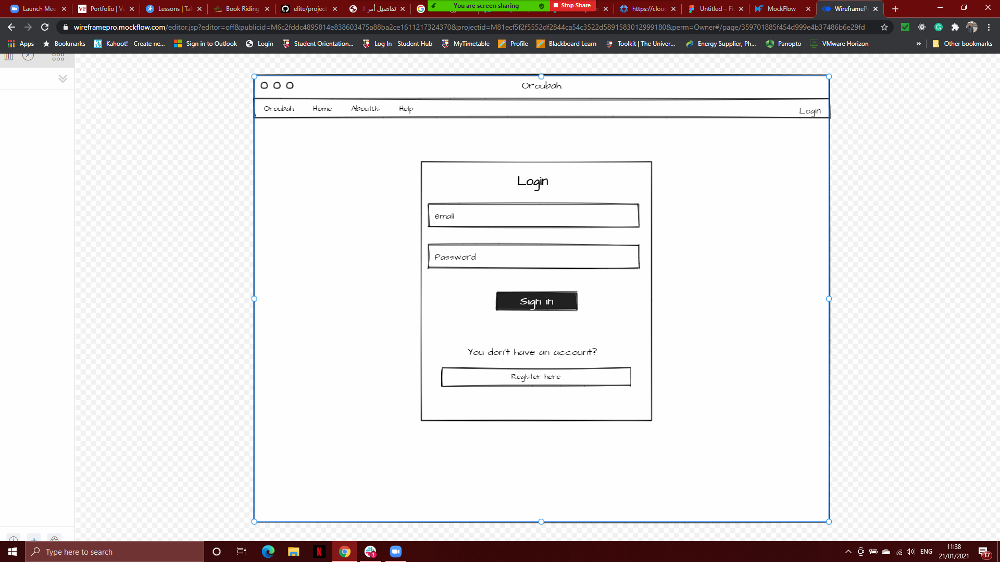
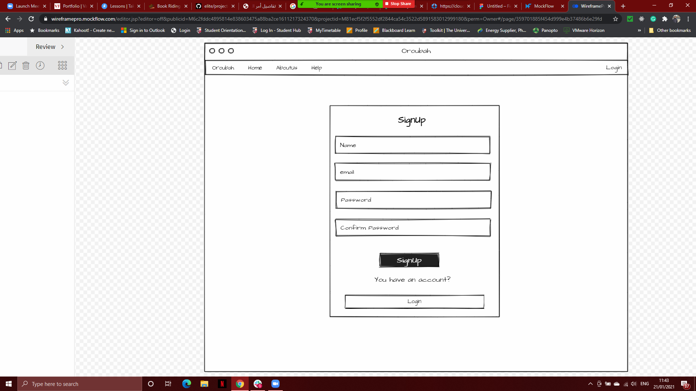
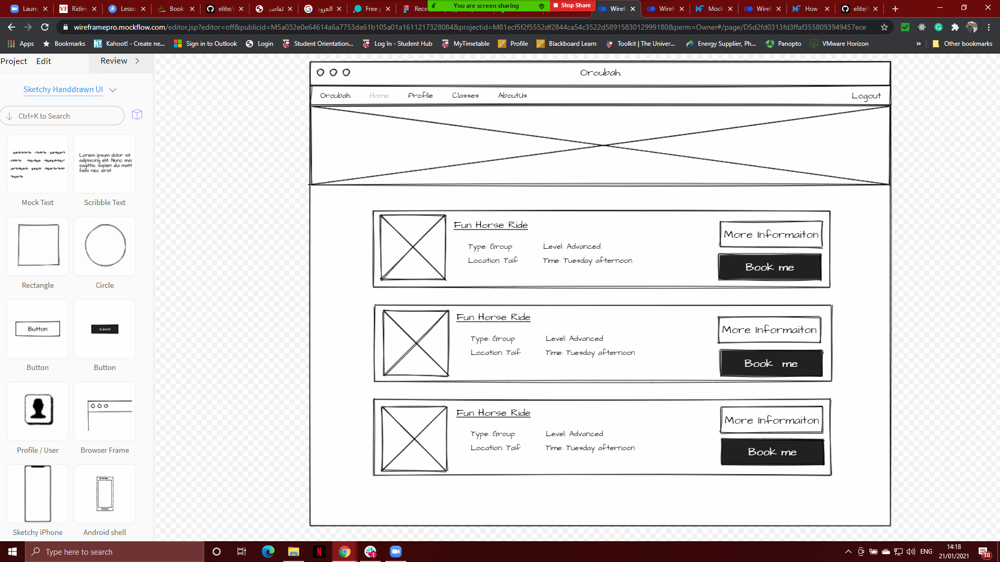
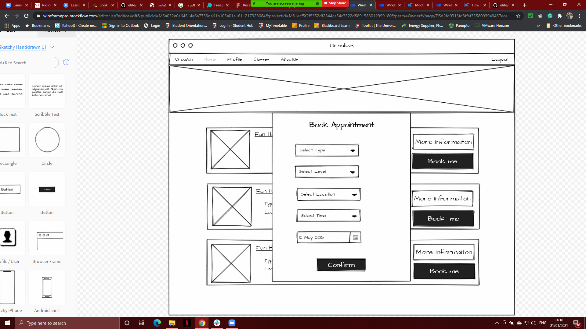
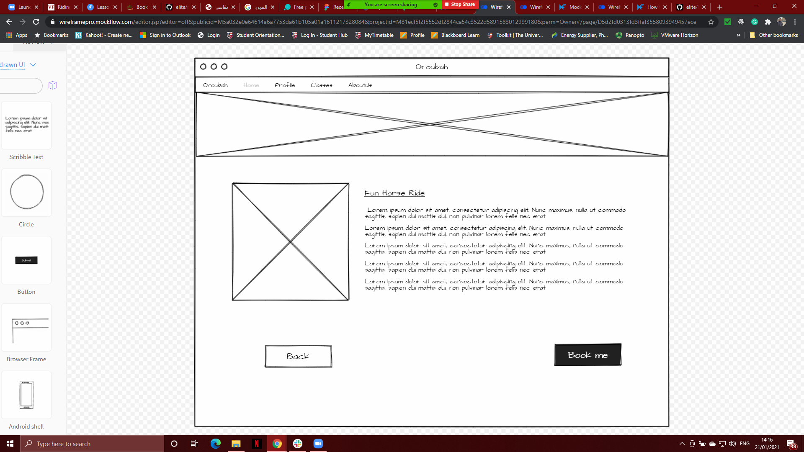
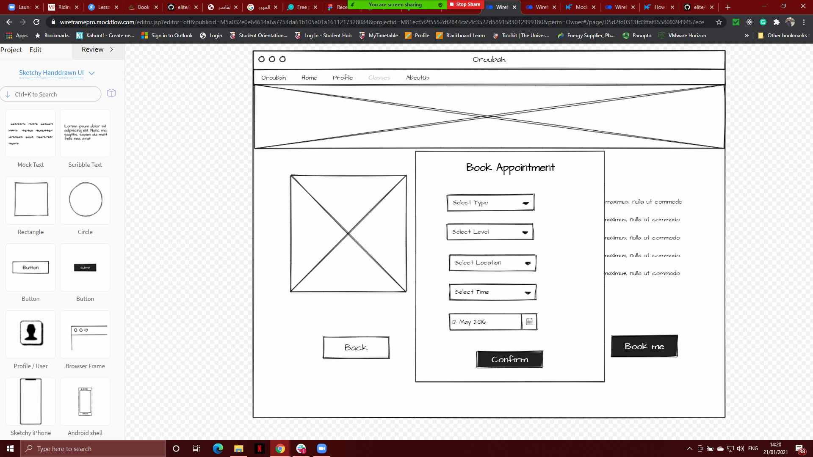
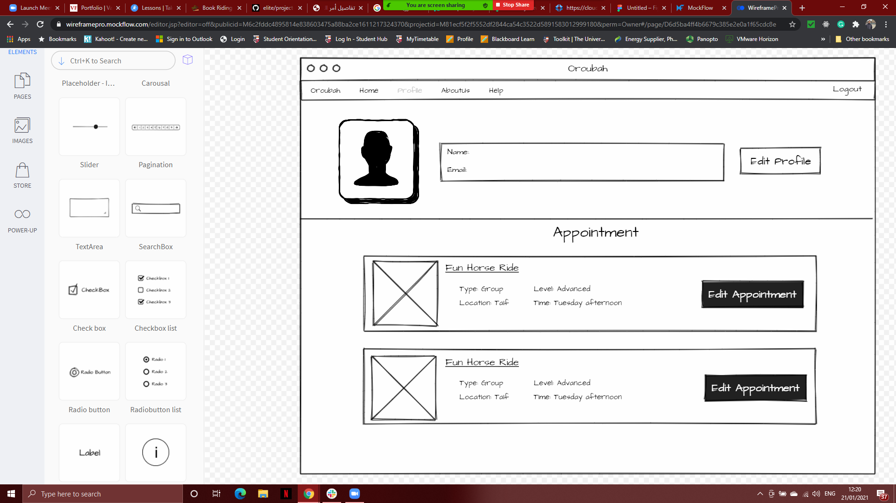
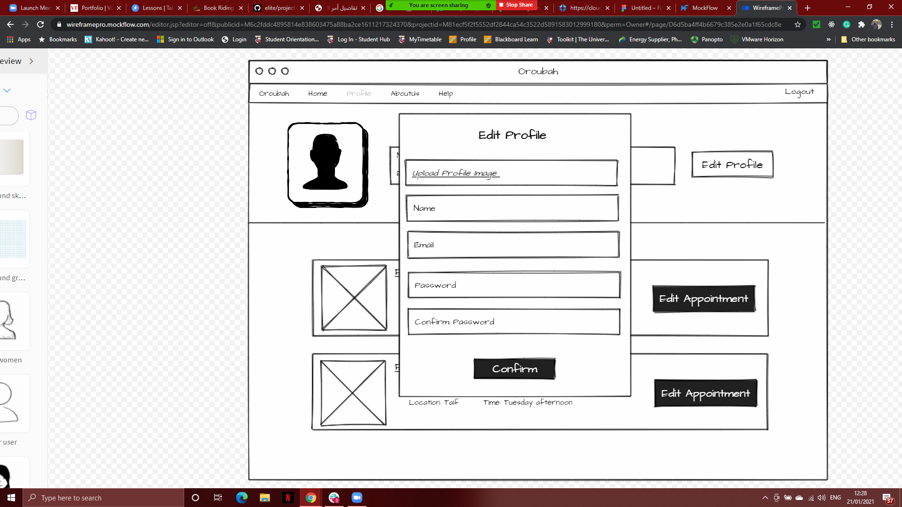
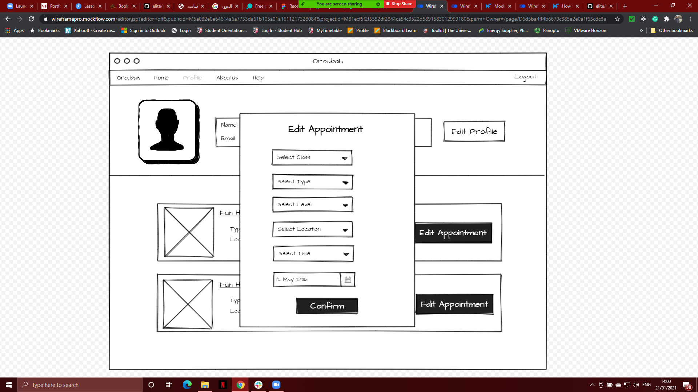

# Orobah

Website for Orobah Academy classes

## Description
Orobah is an Academy for all our customers to book an appointment for differnts classes. Also, a new customer can create an account to book for futuer class and view different type of horses. The academy provide sevral classes, target such as for groups class, persnal, two person..etc. The academy will confirm the appointment once is booked or cancel it for convenit reson.
### Technical Used

- MongoDB, Mongoose
- Express
- REACT
- Node.js
- bootstrap

## Project Wireframe

  
  <i>Fig. 1: The Login page</i>
    
  
  <i>Fig. 2: The SignUp page</i>
    
  
  <i>Fig. 3: The main page</i>
    
  
  <i>Fig. 4: booking </i>
    
  
  <i>Fig. 5: More Information</i>
    
  
  <i>Fig. 6: to be done</i>
    
  
  <i>Fig. 7: profile page</i>
      
  
  <i>Fig. 8: edit profile page</i>
        
  
  <i>Fig. 9: edit appointment page</i>

### User Stories

- as a user I want to be able to securely sign up so I can login
- as a user I want to be able to securely sign in so I can book an appointment
- as a user I want to be able to edit my profile so I can upload image
- as a user I want to be able to edit my profile so I can change my email
- as a user I want to be able to edit my profile so I can securely change password
- as a user I want to be able to edit my profile so I can change my name
- as a user I want to be able to edit my appointment so I can change the date
- as a user I want to be able to edit my appointment so I can change class
- as a user I want to be able to edit my appointment so I can change type
- as a user I want to be able to edit my appointment so I can change type
- as a user I want to be able to edit my appointment so I can change type
- as a user I want to be able to edit my appointment so I can change type
- as a user I want to be able to view all appointments so I can view appointment state

- as an admin I want to be able to accept appointment so I can approved it
- as an admin I want to be able to cancle appointment so I can disapproved it
- as an admin I want to be able to delete appointments so I can make remove it
- as an admin I want to be able to delete users so I can control the website
- as an admin I want to be able to add classes so I can have more classes
- as an admin I want to be able to delete classes so I can have less classes

### User Stories

User must be able to:
- Create an account
- Login to the website
- View classes
- View information
- Edit profile
- Edit appointment
- Add appointment

---

## Planning and Development Process

First we came up with the idea of having horse academy, then we planed and create a wireframe to start with. Created the database Schema. Then we started to program the application.

### Problem-Solving Strategy

We wroked as team to solve problem that we faced and search online for a solutions, ask instrctors for help

### Unsolved problems

All problem Solved, but we might improve it in the future and have more features and styling

## Live link
https://orouba.herokuapp.com
---

## Acknowledgments
Members of Team Elit would like to use this opportunity to say a big thank you to
our supervisors,whose dedicated support and guidance was instrumental to the successful completion of this project requirements.
Lastly, Team Elit acknowledges the relentless and concerted efforts of group members in the delivery of The Orobah Project
